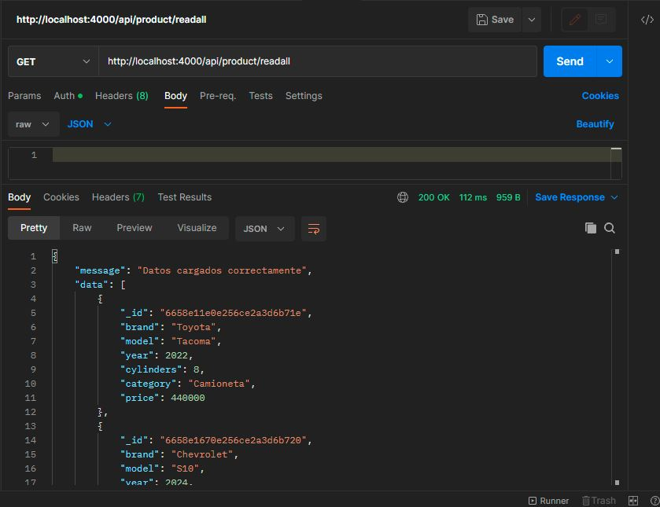

# M6_aplicacion_backend_autenticacion

En el presente proyecto se hace uso de NodeJs, Express, dotenv, MongoDB y bcryptjs para desarrollar
el backend de una apliación web que consta (en esta primera fase) de dos modelos: Modelo Usuario y Modelo Producto.
También se agrega la autenticación y autorización de los usuarios corroborando los tokens generados al momento de realizar un login con los ya guardados en el sistema para que a manera de ejemplo en este desarrollo, permita la creación de un producto siempre y cuando este "logueado".

<h2>Endpoints</h2>

En cada modelo se implementó las operaciones CRUD mediante peticiones HTTP a las rutas correspondientes. Esto se logró gracias a Express y fue verificado con ayuda de la herramienta Postman. Para cada modelo se ha definido un Schema el cual ayuda para obtener correctamente a traves de un JSON la información y esta es guardada en una base de datos NoSQL haciendo uso de Mongoose y MongoAtlas.
Las rutas a las cuales se realizan las peticiones son las solicitadas en la documentación del proyecto.

<h2>Comprobaciones</h2>

Las validaciones del correcto funcionamiento fueron enviadas en Postman obteniendo los siguientes resultados. Solo se adjuntas algunas para no hacer extenso el archivo.

<h3>Users</h3>

Creacion de usuario

Login de usuario

Actualizacion de usuario

<h3>Products</h3>

Creacion de producto

Listado de productos

Eliminacion de producto basado en su ID de MongoDB

Despliegue del proyecto en Render para visualización
Link: https://m6-aplicacion-backend-autenticacion.onrender.com
